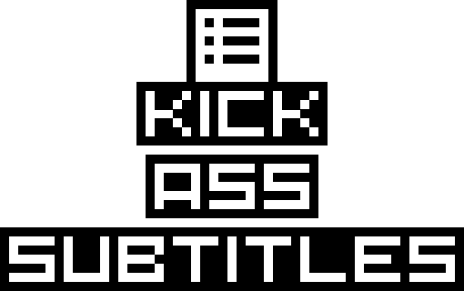

<p align="center">
    
</p>

composer config repositories.list_generator '{"type": "vcs", "url": "git@github.com:tacman/list-generator.git"}'
composer config repositories.tmdb_api '{"type": "vcs", "url": "git@github.com:tacman/api.git"}'

KickAssSubtitles
================

Open-source movie and TV subtitles

Development environment setup
-----------------------------

Follow these steps:

- install [docker](https://www.docker.com/) and
[docker-compose](https://docs.docker.com/compose/)
- `git clone https://github.com/kickasssubtitles/kickasssubtitles.git`
- `cd kickasssubtitles`
- rename `.env_development` to `.env`
- `docker-compose up`
- add following entry to your hosts file: `127.0.0.1 kickasssubtitles.development`
- visit `kickasssubtitles.development` in your browser
- start hacking!

### Database admin tool

Web-interface is available at:

```
host: kickasssubtitles.development:8080
user: kickasssubtitles
password: kickasssubtitles
database: kickasssubtitles
```

If you would like to connect via some desktop client (like
[HeidiSQL](https://www.heidisql.com/)) please use following host:port
combination:

```
kickasssubtitles.development:3306
```

### Mail testing tool

Web-interface is available at:

```
kickasssubtitles.development:8025
```

### Compiling assets

To live-compile assets (scss, js) during development:

- enter running `app` docker-compose service: `docker-compose exec app bash`
- run: `npm run watch` or `npm run watch-poll`

### Running tests & static analysis

- enter running `app` docker-compose service: `docker-compose exec app bash`
- run tests: `composer test`
- run particular test suite: `composer test -- --testsuite TaskProcessor`
- run static analysis tool: `composer static-analysis`

Production environment setup
----------------------------

Application is adapted to be deployed using
[dokku](http://dokku.viewdocs.io/dokku/) in production.
